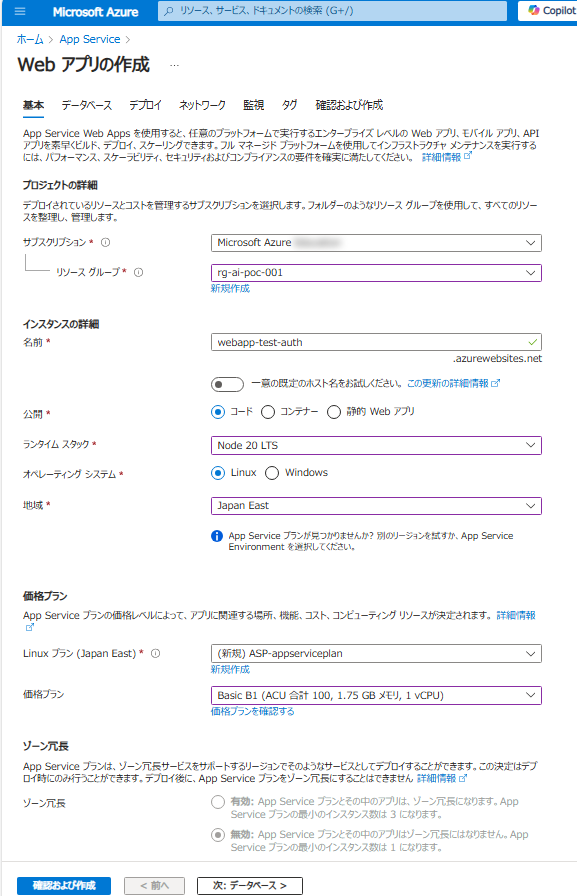
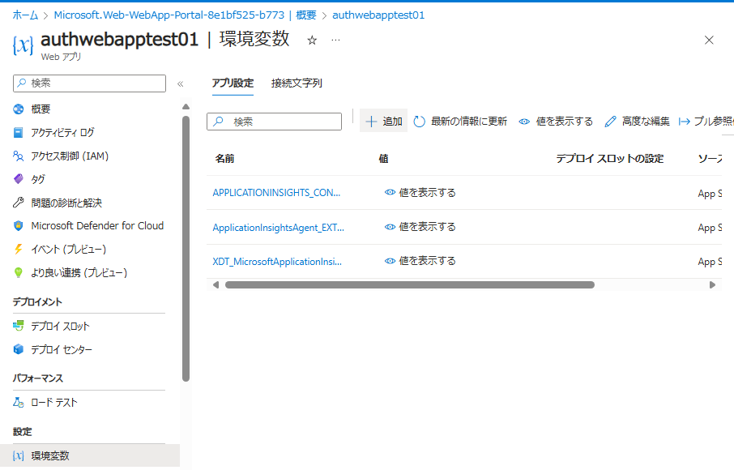
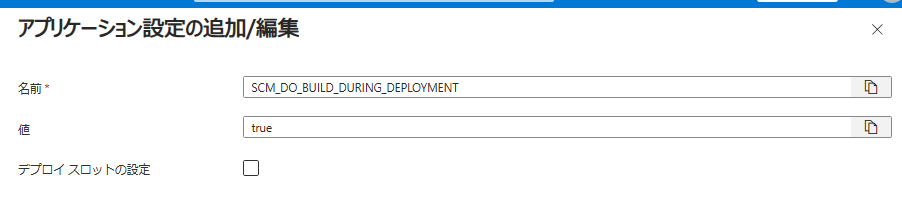
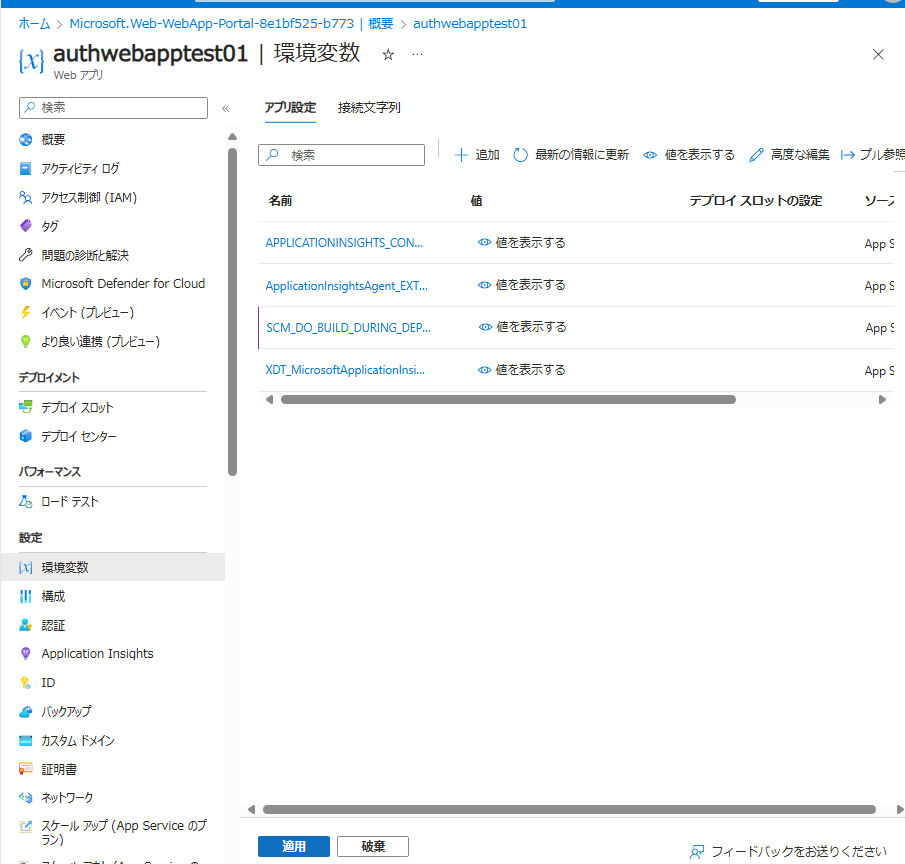
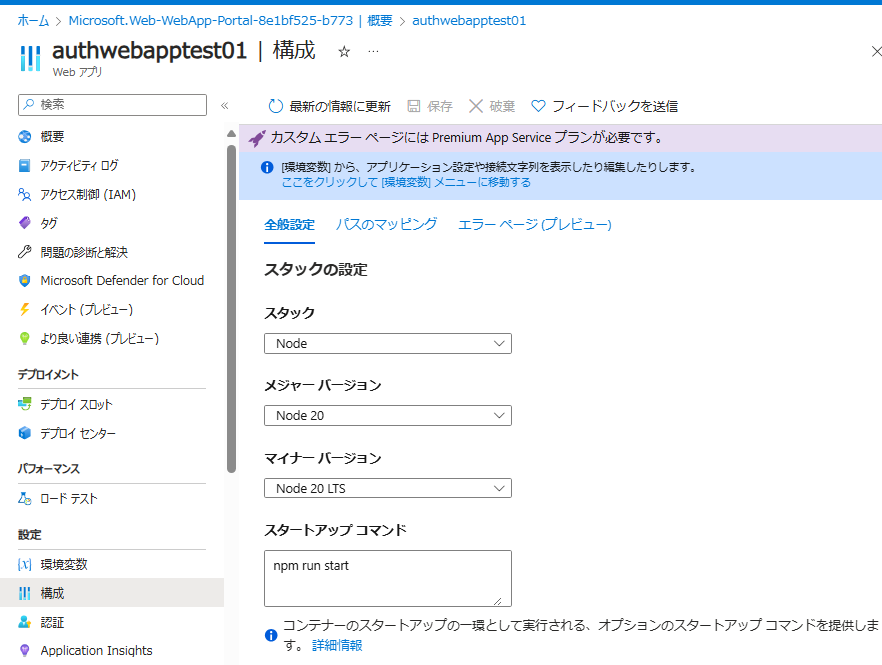
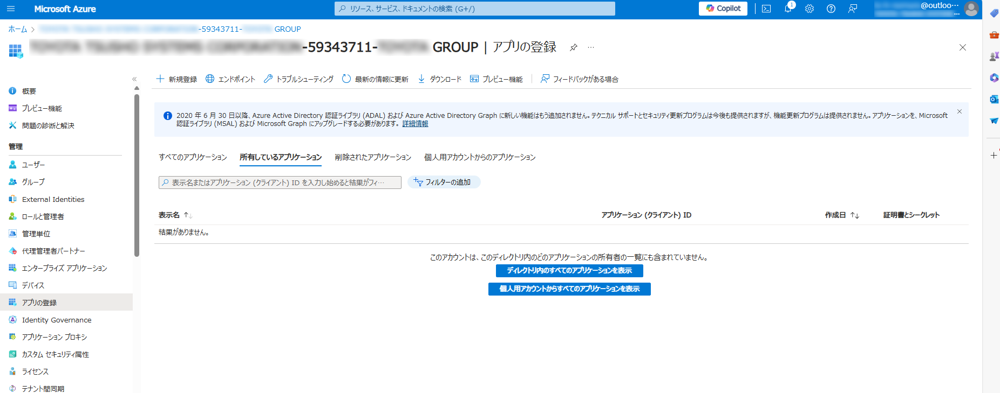

https://learn.microsoft.com/ja-jp/entra/identity-platform/quickstart-web-app-nodejs-msal-sign-in

# アプリのルートディレクトリにserver.jsを追加
<!-- ```javascript
const { createServer } = require("http");
const next = require("next");

const port = process.env.PORT || 3000;
const dev = process.env.NODE_ENV !== "production";
const app = next({ dev });
const handle = app.getRequestHandler();

app.prepare().then(() => {
  createServer((req, res) => {
    handle(req, res);
  }).listen(port, (err) => {
    if (err) throw err;
    console.log(`> Ready on http://localhost:${port}`);
  });
});
``` -->

# AppService作成



その他の設定はすべてデフォルト値

## 環境変数の追加

環境変数に以下を追加
- SCM_DO_BUILD_DURING_DEPLOYMENT: true






## スタートアップコマンドの設定

スタートアップコマンドに以下を追加
```bash
npm run start
```


## デプロイ


# アプリケーションの登録


